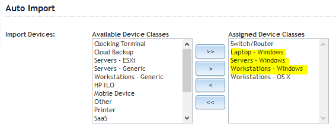
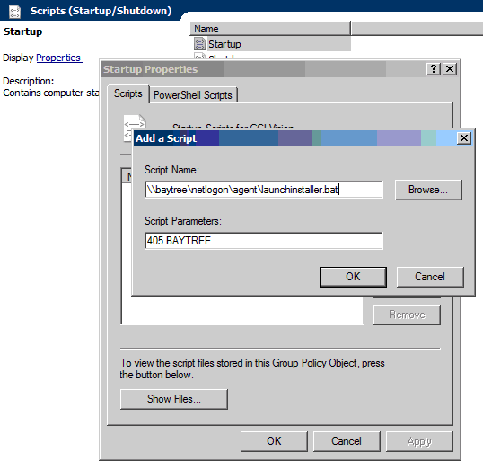
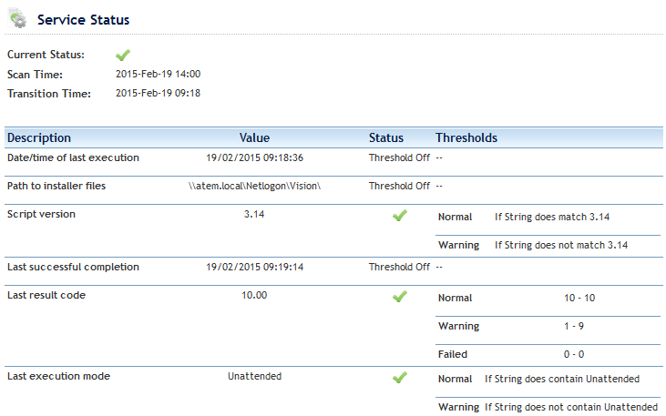

# InstallAgent

This script is intended as a replacement for the stock N-central group policy installer script as provided by N-able. It is not supported by N-able, so please do not contact their support department regarding any problems or questions about this script. In addition, it is not supported by GCI Managed IT.

The script provides:

-   Automatic installation of Microsoft .NET 4.5.2 and Windows Imaging Components on devices that do not have it installed

-   Automatic installation of the N-able agent

-   Detection of broken agents and automatic remove-and-reinstall

-   Self-healing on agent services

-   Very verbose logging into the Application event log

**
-   Customisable for your environment

-   Interactive (double click) mode

If you find a problem with the script or have ideas on how it could be improved post an issue on GitHub . Alternatively, post on the NRC discussion forum.

If you use this in your environment I’d love to hear from you!

***Disclaimer: This script is provided in good faith and must be tested in your own environment before wide-scale deployment***

# Configure files for your own use

### InstallAgent.ini

**Be sure to edit InstallAgent.ini with a plain text editor, such as Notepad.  Other advanced text editors are known to corrupt the .ini file.**
**The file must be saved with ASCII encoding.**

All the normal partner-customized parameters are in the file *AgentInstall.ini.*

| Value | Default | Purpose |
| ----- | ------- | ------- |
| *ServerAddress* | | This address is pinged at the start of the script to see whether or not the device has Internet access. |
| *Branding* | Solarwinds N-central MSP  | Change this to ‘brand’ the script. For example, you might change it to be the name of your company.|
| *ContactAdminMsg* | Please contact your IT administrator, support company or managed service provider to report this problem. | A message that appears when a critical error appears. You may want to change this into your local language. |
| *AgentFolder* | Agent | The name of the folder where you store the GPO files.
| *SOAgentVersion* |  | Update this to match the version of the agent you're deploying.  The format of this entry matches the format of the agent version displayed in N-Central |
| *SOAgentFileVersion* | | The Windows file version of the agent installer executable.  This entry matches the **File version** field on the Details tab of the executable file properties. |

### InstallAgent.vbs

Additional advanced configuration can be carried out in the script:

| Value | Default | Purpose |
| ----- | ------- | ------- |
| *strPingAddress* | 8.8.8.8 | This address is pinged at the start of the script to see whether or not the device has Internet access. |
| *strSOAgentEXE* | SOAgentSetup.exe | This is the name of the SO-level agent installer file. |
| *intPingTolerance* | 20 | Percentage value of dropped packets before the Connectivity test is deemed to fail |
| *intPingTestCount* | 10 | The number of pings performed by the Connectivity test. |

# Configure N-central for automatic device import

As default, if a device gets the agent installed it will still need to be manually imported into the All Devices view of N-central. This can be automated so that devices appear in the view without any manual intervention.

To do this, perform the following change in N-central:

1.  Go to your SO level

2.  Click *Administration -&gt; Discovery Defaults*

3.  Ensure that *Workstations – Windows, Laptops – Windows* and *Servers – Windows* are all in the Auto-Import section (see below)

4.  Click *Save*

# Set up the script files on your network

These steps assume that you are using the defaults given in the tables above. If you have amended any of the configuration file values, remember to use your own values in these steps.

1. On a domain controller, open the NETLOGON folder and create a folder called AGENT

2. Copy INSTALLAGENT.VBS, your customized INSTALLAGENT.INI, and LAUNCHINSTALLER.BAT into the AGENT folder

3. In N-central, go to the SO level and click the DOWNLOAD AGENT/PROBE SOFTWARE link

4. Download the WINDOWS AGENT file into the AGENT folder, renaming it as SOAGENTSETUP.EXE

5. Download the .NET FRAMEWORK 4.5.2 file into the AGENT folder, leaving the filename unchanged

6. Download the Windows Imaging Component files, *wic\_x64\_enu.exe,* and *wic\_x86\_enu.exe,* from https://www.microsoft.com/en-us/download/details.aspx?id=1385 into the AGENT folder

7. Copy the AGENTCLEANUP4.EXE utility into the AGENT folder

You should now have a folder called AGENT that contains:

-   INSTALLAGENT.VBS 

-   INSTALLAGENT.INI

-   LAUNCHINSTALLER.BAT

-   NDP452-KB2901907-x86-x64-AllOS-ENU.EXE

-   SOAGENTSETUP.EXE

-   WIC\_X64\_ENU.EXE

-   WIC\_X32\_ENU.EXE

-   AGENTCLEANUP4.EXE

# Create the Group Policy Object on your network

1.  Create a new GPO and link to a suitable OU or to the domain itself

2.  Expand the COMPUTER CONFIGURATION section and navigate through to SCRIPTS

3.  Create a new STARTUP script. The command to run is *\\\\DOMAIN\\NETLOGON\\AGENT\\LAUNCHINSTALLER.BAT* and the parameters field should *be XXX DOMAINNAME*, where XXX is the numerical customer ID code in N-central and DOMAINNAME is the Active Directory domain name. For example, 405 BAYTREE

Congratulations! Your installation is now complete.

# Testing and troubleshooting

To test the script you can either run it in an admin command prompt or double click on it from the AGENT folder. If you double click it, it will run in a special interactive mode. If you run it in a command prompt it runs in a hands-free mode.

*CSCRIPT \\\\DOMAIN\\NETLOGON\\AGENT\\INSTALLAGENT.VBS /site:XXX*

-   On a device that doesn’t have the agent or .NET 4.5.2 installed, the script will install .NET and then install the agent. If the Windows Imaging Components software (a pre-req for .NET 4) is not installed, this is installed for you.

-   On a device that has .NET 4 installed but no agent, the script will install the agent.

-   On a device that has an outdated version of the agent, it will uninstall the old agent and install the new one.

-   On a device that has a broken or unresponsive agent, it will forcibly reinstall the agent. This can take about five minutes to complete.

-   On a device that has been deleted from N-central, the agent will be reinstalled and begin checking into N-central shortly after the reinstall has completed

The script logs its progress into the Application event log under source *WSH* (Windows Scripting Host). It’s very verbose and the log is a great place to look when you’re trying to find out why a device hasn’t installed the agent.

# Excluding devices

It’s not always desirable to install the agent on every single device. For example, you may have a customer that has EPOS tills that although are joined to the domain, they do not require management. There’s a couple of ways you can do this. Best Microsoft practice would be to create a domain group containing the computer objects for the devices and setting a Deny on the ACL for the Group Policy Object that runs the script. Another way is to double click on INSTALLAGENT.VBS and respond YES to the first question. Once you’ve done that, the script will still run on the device but it will exit immediately, doing nothing.

# Exit codes

On a normal execution, the script exits with a code of 10. This is to remove any ambiguity that might arise from an accidental code of 0 being returned for any reason. The following codes can also be returned. These exit codes are written into the Application event log when the script finishes running and can also be found in the custom service.

> 0 Internal error

>

> 1 NET4 not installed / OS earlier than Windows 7 detected

>

> 2 No external network access detected

>

> 3 Install source is missing / wrong version

>

> 4 Failure to install .NET 4.5.2

>

> 5 Failure to install agent

>

> 6 Risk of downgraded/Zombie agent detected

>

> 7 Reserved for future use

>

> 8 Reserved for future use

>

> 9 Reserved for future use

>

> 10 Normal execution

# Routine maintenance

When you upgrade your N-central you will need to update the script and installer file to recognise the new version of the agent.

1. Update the SOAGENTSETUP.EXE file inside the AGENT folder  

2. Locate the line beginning *SOAgentVersion* and set it to be the version of the agent that you wish to use  

3.  Right-click over the SOAGENTSETUP.EXE file and select *Properties*.  Go to the *Details* tab. Make a note of the *File Version* and set the line beginning with *SOAgentFileVersion* to match it.

Tip! There are a number of partners on the NRC discussion forum who have implemented Automation Policies or scripts that are designed to ease this task, so I strongly recommend that you grab the most suitable one for your needs.

# Custom service

When the script executes, it writes its progress into the Registry. This information can be gathered and reported on within N-central itself so you can see how your devices are behaving with the script. The custom service, called *Agent Installer Script Status*, can only be used on 9.5 SP1 onwards.

# Credits

Thanks go to Pat Albert of N-able for development of the AGENTCLEANUP4.EXE utility and to everyone on the N-able forums who has helped and contributed ideas to this script.

